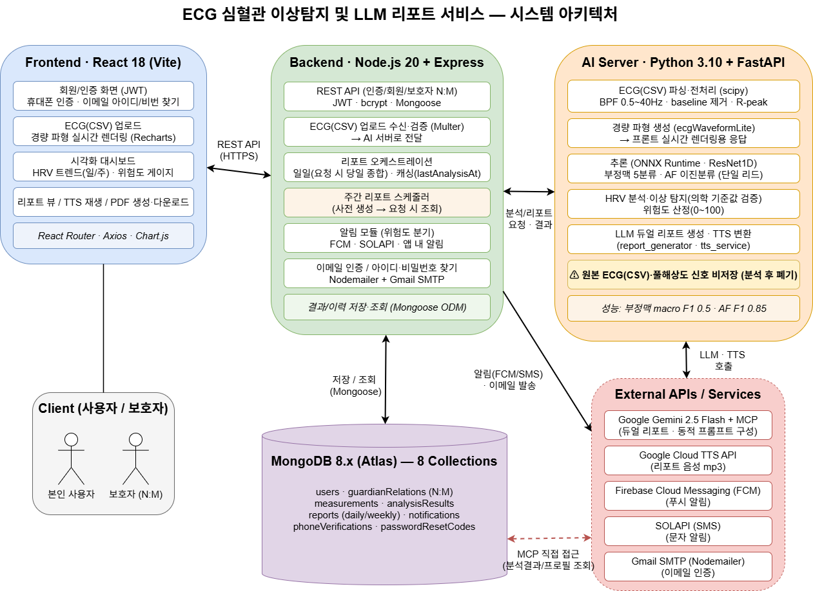
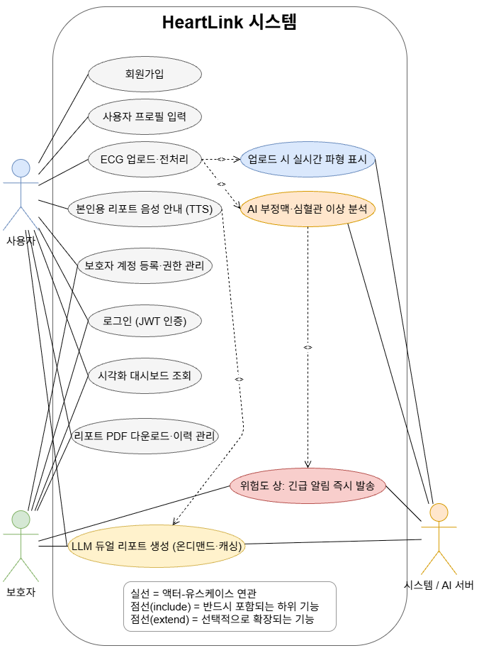
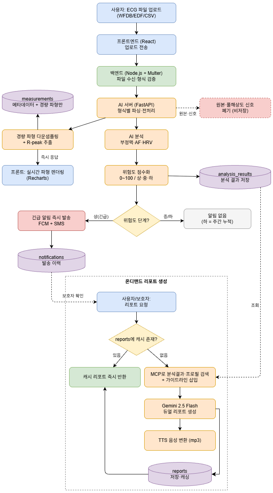
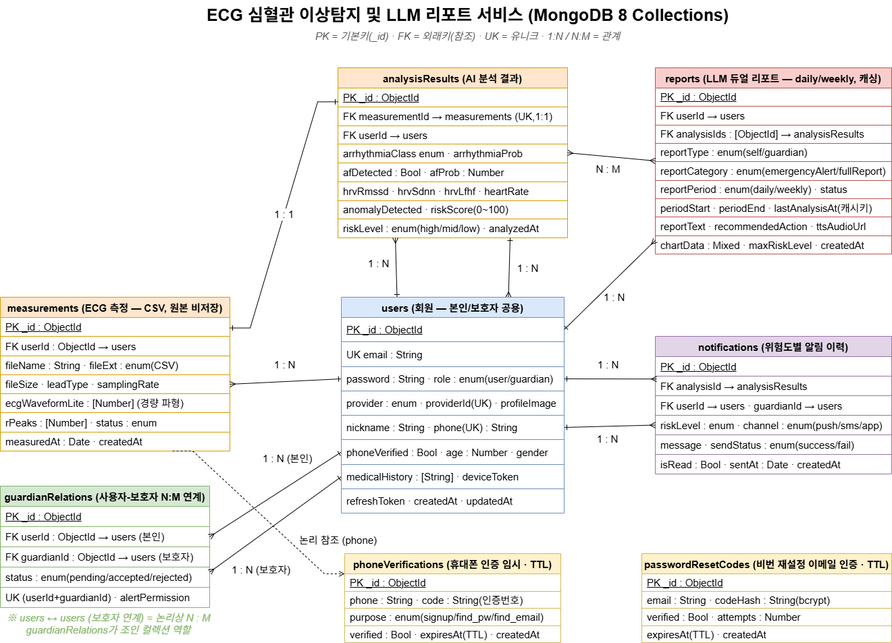

# ❤️ HeartLink

> ECG 생체신호 기반 심혈관 이상 조기탐지 및 LLM 기반 보호자 자연어 리포트 서비스

**팀명: HeartLinkers**

 

## 📑 목차
1. [프로젝트명](#1-프로젝트명)
2. [서비스 소개](#2-서비스-소개)
3. [프로젝트 기간](#3-프로젝트-기간)
4. [주요 기능](#4-주요-기능)
5. [기술 스택](#5-기술-스택)
6. [시스템 아키텍처](#6-시스템-아키텍처)
7. [유스케이스](#7-유스케이스)
8. [서비스 흐름도](#8-서비스-흐름도)
9. [ER 다이어그램](#9-er-다이어그램)
10. [화면 구성](#10-화면-구성)
11. [팀원 역할](#11-팀원-역할)
12. [트러블슈팅](#12-트러블슈팅)

 

## 1. 프로젝트명

**HeartLink** — ECG 생체신호 기반 심혈관 이상 조기탐지 및 LLM 기반 보호자 자연어 리포트 서비스

- 팀명: **HeartLinkers**
- 멘토 기업: ㈜뷰노

 

## 2. 서비스 소개

초고령사회 진입과 1인 가구 고령자 증가로, 심혈관 이상이 발생해도 즉각적인 보호자 연락이 어려운 사각지대가 확대되고 있습니다.

HeartLink는 웨어러블로 측정한 ECG(심전도) 데이터를 AI로 분석하여 **부정맥·심방세동(AF) 등 심혈관 이상을 조기 탐지**하고, 위험도(상/중/하)에 따라 **보호자에게 자동으로 알림**을 전송합니다. 또한 LLM(Gemini)을 통해 **본인용·보호자용 듀얼 리포트**를 자연어로 생성하여 의학용어 장벽을 해소하며, 본인용 리포트는 음성(TTS)으로도 제공해 시력이 약한 고령자의 접근성을 확보합니다.

ECG 원본 데이터는 저장하지 않고 분석 후 즉시 폐기하여 민감 의료정보 노출을 최소화하는, **1인 가구 고령자 특화 심혈관 케어 시스템**입니다.

#### 🔑 차별점
- 보호자(가족) 계정을 **최대 3인** 연계하여 위험도별 자동 알림 분기
- **본인용 + 보호자용 듀얼 LLM 리포트** 생성 (본인용은 TTS 음성 제공)
- 대한심장학회 가이드라인을 인컨텍스트로 삽입하여 **LLM 환각 최소화**
- ECG 원본 미저장으로 **개인정보 보호 강화**

 

## 3. 프로젝트 기간

**2026-05-26 ~ 2026-07-09**

| 주차 | 기간 | 주요 활동 |
|------|------|-----------|
| 1주차 | 05/26 ~ 06/01 | 요구사항 정의, 멘토링 |
| 2주차 | 06/02 ~ 06/08 | 데이터셋 확보·EDA, 화면 설계 (06/08 기획 발표) |
| 3주차 | 06/09 ~ 06/15 | AI 베이스라인 학습, API 골격 구축 |
| 4주차 | 06/16 ~ 06/22 | AI 모델 성능 개선, LLM 파이프라인 |
| 5주차 | 06/23 ~ 06/29 | 보호자 알림, TTS 모듈, 통합 (06/26 최종 시연) |
| 6주차 | 06/30 ~ 07/09 | 통합 테스트, 시연 영상, 발표 (07/09 발표회) |

 

## 4. 주요 기능

| 구분 | 기능 |
|------|------|
| 👤 사용자/보호자 관리 | 회원가입·로그인(JWT), 보호자 계정 등록(최대 3인) 및 권한 관리, 프로필 입력 |
| 📤 ECG 업로드·전처리 | WFDB/EDF/CSV 업로드, 대역통과 필터(0.5~40Hz)·baseline wander 제거, R-peak 검출 |
| 🧠 AI 분석 | 부정맥 5종 분류(ResNet1D), 심방세동(AF) 이진 분류, HRV 기반 이상 탐지, 위험도 점수화(0~100) |
| 📝 LLM 듀얼 리포트 | 본인용(친절 안내체)·보호자용(위험도 요약+권장 조치) 리포트 생성, 온디맨드·캐싱 |
| 🔊 음성 안내 | 본인용 리포트 한국어 TTS(mp3) 변환 |
| 🔔 보호자 알림 | 상(긴급)=FCM+SMS 즉시 / 중=24시간 내 확인 권장 / 하=주간 요약 |
| 📊 시각화 대시보드 | ECG 파형+R-peak, HRV 트렌드, 위험도 게이지, 보호자 통합 모니터링 |
| 📄 리포트 관리 | 과거 리포트 이력 조회 및 PDF 다운로드 |

 

## 5. 기술 스택

#### Frontend

- React 18 (Vite), React Router, Axios
- Recharts (ECG 파형/트렌드), Chart.js (HRV)
- Figma (UI/UX 설계)

#### Backend

- Node.js 20.x + Express.js
- JWT, bcrypt (인증·암호화), Multer (업로드)
- Mongoose (ODM), Firebase Admin SDK (FCM), Twilio (SMS)

#### AI / Data

- Python 3.10 + FastAPI
- wfdb, scipy (전처리), PyTorch (ResNet1D), scikit-learn (Isolation Forest)
- ONNX / ONNX Runtime (경량 추론 배포)

#### API / Infra

- Google Gemini 2.5 Flash API + MCP (Model Context Protocol)
- Google Cloud TTS API, Firebase Cloud Messaging, Twilio
- MongoDB 8.x (Atlas), GitHub, Notion

 

## 6. 시스템 아키텍처

프론트엔드(React) ↔ 백엔드(Node.js/Express) ↔ AI 서버(Python/FastAPI)를 분리하여 확장성을 확보하고, MongoDB와 외부 API(Gemini+MCP, TTS, FCM, Twilio)를 연동합니다.

[ React 18 + Vite ] ──REST API── [ Node.js 20 + Express ] ──분석 요청/결과── [ Python 3.10 + FastAPI ] 대시보드 JWT·bcrypt·Multer wfdb·scipy 전처리 Recharts/Chart.js 리포트/알림 관리 ResNet1D·AF·Isolation Forest │ ONNX Runtime 추론 ▼ │ [ MongoDB 8.x / Atlas ] ◄──── MCP 직접 접근 ────[ Gemini 2.5 Flash ] users · guardian_relations · measurements analysis_results · reports · notifications
> ※ 원본 ECG·풀해상도 신호는 저장하지 않고 분석 후 폐기

 

## 7. 유스케이스

- **사용자**: 회원가입, 로그인, 프로필 입력, ECG 업로드, 보호자 등록, 리포트 음성 안내(TTS), 대시보드 조회, 리포트 PDF 다운로드
- **보호자**: 로그인, 등록 요청 수락, 위험도 알림 수신, 대시보드 조회, 리포트 조회
- **시스템/AI 서버**: ECG 전처리, AI 부정맥·심혈관 이상 분석, 위험도 산정, LLM 듀얼 리포트 생성, 보호자 알림 발송

> 실선 = 액터-유스케이스 연관 / 점선(include) = 필수 포함 기능 / 점선(extend) = 선택 확장 기능

 

## 8. 서비스 흐름도

ECG 업로드(WFDB/EDF/CSV) ↓ 프론트엔드 업로드 전송 → 백엔드 파일 검증(Multer) ↓ AI 서버 파싱·전처리 ──(경량 파형 즉시 응답)──▶ 프론트 실시간 렌더링 ↓ 원본·풀해상도 신호 폐기(비저장) AI 분석 (부정맥·AF·HRV) ↓ 위험도 점수화 (0~100 / 상·중·하) ──▶ analysis_results 저장 ↓ [위험도 분기] ├─ 상(긴급) → FCM + SMS 즉시 발송 → notifications 저장 └─ 중/하 → 알림 보류 (하 = 주간 누적)

[온디맨드 리포트 생성] 리포트 요청 → reports 캐시 존재? ├─ 있음 → 캐시 리포트 즉시 반환 └─ 없음 → MCP로 분석결과·프로필 검색 + 가이드라인 삽입 → Gemini 2.5 Flash 듀얼 리포트 생성 → TTS 음성 변환(mp3) → reports 저장·캐싱

 

## 9. ER 다이어그램

MongoDB 6개 컬렉션으로 구성됩니다.

| 컬렉션 | 설명 | 주요 관계 |
|--------|------|-----------|
| `users` | 본인/보호자 공용 계정·프로필 | 모든 컬렉션의 중심 |
| `guardian_relations` | 사용자-보호자 연계 및 알림 권한 | users 1:N (최대 3인) |
| `measurements` | ECG 메타데이터·경량 파형 (원본 비저장) | users 1:N |
| `analysis_results` | 부정맥·AF·HRV·위험도 분석 결과 | measurements 1:1 |
| `reports` | LLM 듀얼 리포트·TTS·PDF 경로 | analysis_results 1:N |
| `notifications` | 위험도 단계별 보호자 알림 이력 | users·guardian 참조 |

 

## 10. 화면 구성

| 화면 | 설명 |
|------|------|
| 회원가입 / 로그인 | 이메일·비밀번호·닉네임 입력, JWT 인증 |
| 프로필 입력 | 연령·성별·기저질환·복용약 입력 |
| 보호자 등록 | 보호자 정보 입력 및 권한 관리 (최대 3인) |
| ECG 업로드 | 파일 업로드 및 실시간 파형 렌더링 |
| 대시보드 | ECG 파형+R-peak, HRV 트렌드, 위험도 게이지, 이상 탐지 타임라인 |
| 리포트 | 본인용/보호자용 듀얼 리포트, TTS 재생, PDF 다운로드 |
| 보호자 전용 뷰 | 가족 구성원 통합 모니터링 |

> 🎨 화면 설계: [Figma 링크 추가 예정]

 

## 11. 팀원 역할

| 이름 | 역할 | 담당 업무 |
|------|------|-----------|
| **주양덕** | 팀장 / PM / DB | 프로젝트 일정·역할 관리, 산출물 총괄, 문서 작업, PPT·발표, MongoDB 스키마 설계 및 인덱스 전략, Mongoose 기반 회원가입 구현 |
| **문정인** | Frontend | React + Recharts 기반 보호자/사용자 대시보드, ECG 파형·위험도 시각화 UI |
| **김동건** | Frontend | 시니어 친화적 UI 설계, 사용자 화면 구현 |
| **신예은** | AI / Data Modeling | ECG 공개 데이터셋 조사·EDA, ResNet1D 부정맥·AF 분류 모델, HRV 이상 탐지, Gemini+MCP LLM 리포트 파이프라인 |

> Backend(Node.js + Express, JWT 인증, FCM/SMS 알림) 및 AI 서버 연동은 팀 협업으로 진행

 

## 12. 트러블슈팅

작업 중 발생한 이슈와 해결 과정을 기록합니다.

#### 🐛 이슈 #1: [제목]
- **문제**: 
- **원인**: 
- **해결**: 

#### 🐛 이슈 #2: [제목]
- **문제**: 
- **원인**: 
- **해결**: 

> 예시 항목 (개발 진행하며 채워넣으세요)
> - ECG 원본 미저장 정책과 재분석 요구 사이의 1:1 제약 충돌 해결
> - 대용량 모델 가중치(.onnx) Git 용량 초과 → Git LFS / 외부 스토리지 전환
> - Gemini MCP 연동 시 MongoDB 접근 권한·응답 지연 처리
> - FCM + SMS 이중 발송 중복 알림 방지 로직

 

---

**© 2026 HeartLinkers** | ECG × AI × LLM 심혈관 케어 플랫폼

